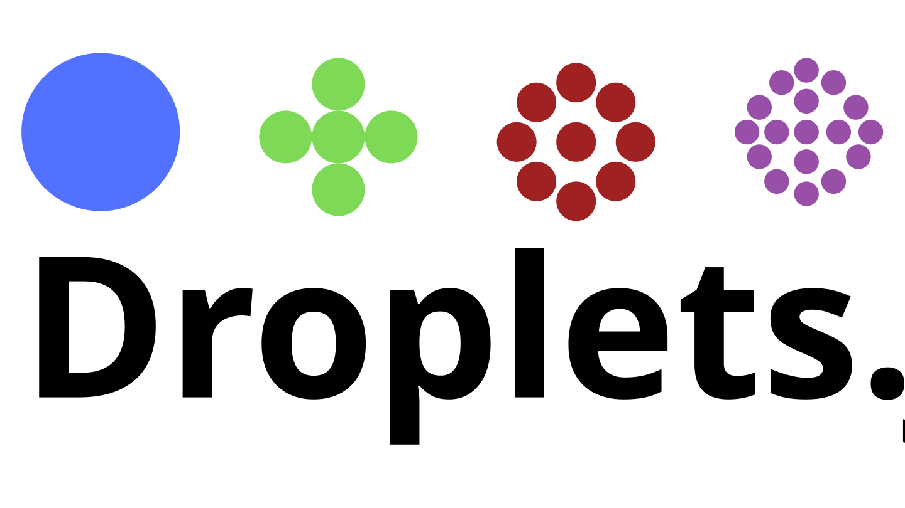
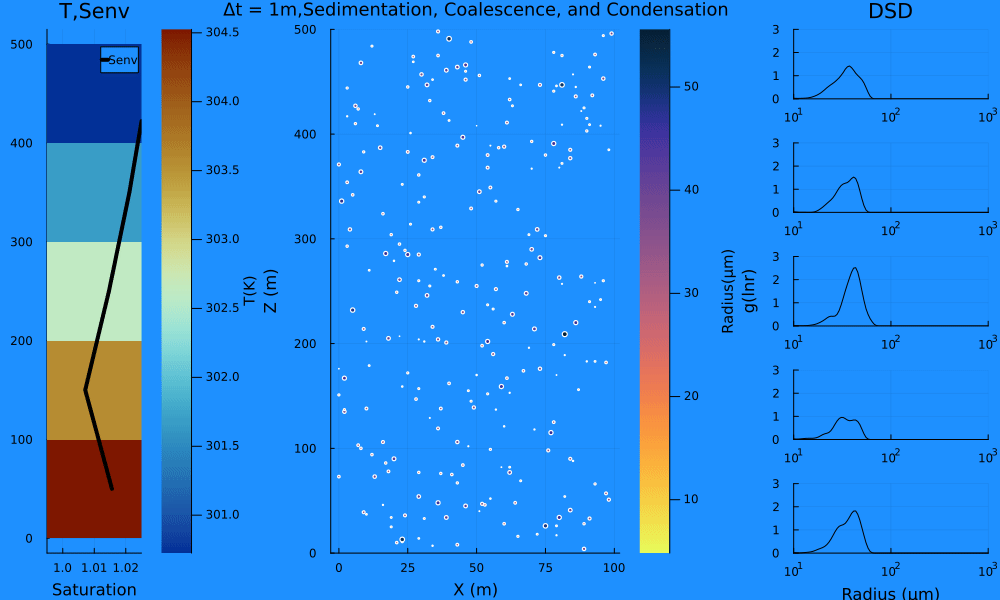

# 
A Julia language implementation of the superdroplet method [(Shima et al., 2009)](https://doi.org/10.1002/qj.441).
[](https://github.com/emmacware/Droplets.jl/actions/workflows/CI.yml?query=branch%3Amain)
[](https://app.codecov.io/gh/emmacware/Droplets.jl)    


## Features

- Superdroplet coalescence scheme (Shima et al. 2009 SDM), with multiple kernel options
- Droplet activation/diffusional growth via the κ-Köhler equation
- Droplet motion and settling
- MPDATA scheme for fluid advection (Smolarkiewicz, 1998)
- Turbulence closures and functions (Abade and Grabowski., 2018; Mellor-Yamada 2.5)
- 0D and 1D spatial architecture for cloud simulations

## Examples

- Box model collision-coalescence and/or condensation
- Superdroplet microphysics coupling for CloudMicrophysics.jl parcel model
- 1D and 2D MPDATA advection examples
- MPDATA Warm Bubble Boussinesq solver
- 1D Kinematic Rainshaft with prescribed Thermodynamics (Shipway and Hill, 2012, PySDM)
- A single-column DyCOMSII-RF02 stratocumulus example with MPDATA advection and a TKE-based turbulence closure (Wyant et al., 2007, Ackerman et al., 2009)



Droplets.jl is not currently in the julia directory, so to install and use as a package clone the git repo:

```bash
git clone https://github.com/emmacware/droplets.jl/
```
navigate to the directory

```julia
julia

julia> ]

pkg> dev .

pkg> instantiate
```

to run the [Shima et al., 2009](https://doi.org/10.1002/qj.441) box model collision-coalecence case (using the Golovin kernel with an initial exponential distribution) from terminal, navigate to the Droplets/Examples directory and run
```bash
julia SDMCollisions/run_file.jl
```

or on Colab in a jupyter notebook (making sure to change runtime type to Julia):
[](https://colab.research.google.com/github/emmacware/Droplets.jl/blob/main/Examples/SDMCollisions/box_collision_coalescence.ipynb)

Help for the Droplets functions and structs can searched with 

```julia
julia> ?
help>
```

## Documentation

- **[Droplets Documentation](https://emmacware.github.io/Droplets.jl/dev/)** 
